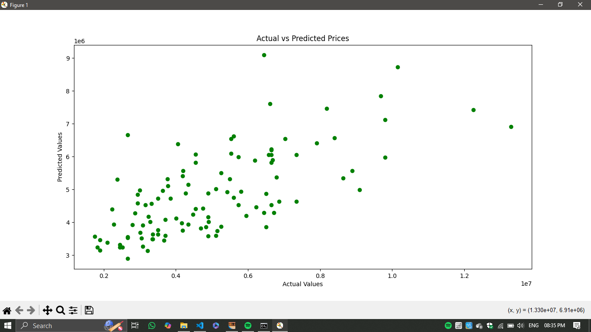
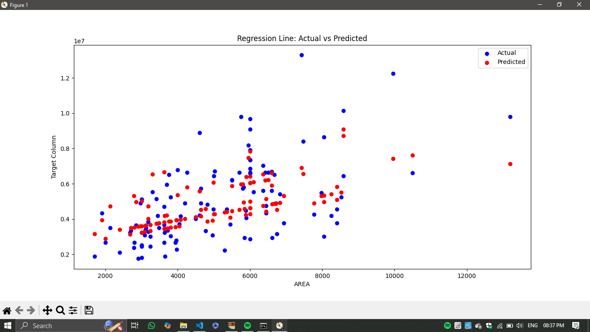

# CODETECH-TASK2
LINEAR REGRESSION MODEL

- **Name**: NITHYA SRI P R 
- **Company**: CODTECH IT SOLUTIONS  
- **ID**: CT08EPR  
- **Domain**: Data Analytics  
- **Duration**: December 2024 to January 2025

---  
### Description:

In this task, we implement a simple linear regression model to predict housing prices based on features like area, number of bedrooms, and bathrooms. The dataset is split into training and testing sets, and the model is trained on the training data. We evaluate the model's performance using Mean Squared Error (MSE) and R-squared metrics. Lastly, the actual vs predicted values are visualized to assess the model's accuracy.

---

### Steps Involved:

1. **Data Loading**: Load the housing dataset .
2. **Feature and Target Columns**: Select the appropriate feature columns  and the target column .
3. **Data Splitting**: Split the data into training and testing sets using an 80-20 ratio.
4. **Model Training**: Train a Linear Regression model using the training data.
5. **Model Evaluation**: Evaluate the model using MSE and R-squared metrics.
6. **Visualization**: Visualize the comparison of actual vs predicted prices using a scatter plot.

---

### Metrics:

- **Mean Squared Error (MSE)**: Measures the average of the squares of the errors between actual and predicted values.
- **R-squared**: Indicates how well the model fits the data, with 1 being perfect accuracy and 0 indicating no relationship between the variables.

---

## Output

Below are the visualizations generated (scatter plots) :

### Actual Vs Predicted Value Output

### Regression line Output

